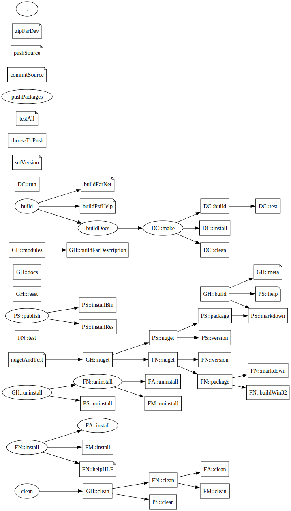
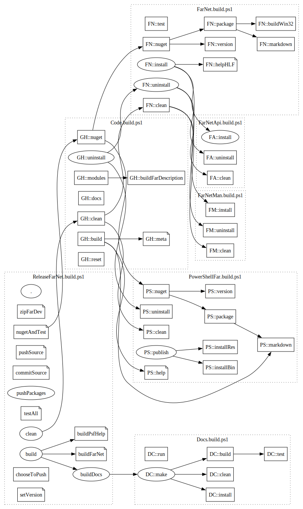

# Building FarNet Showcase

[FarNet]: https://github.com/nightroman/FarNet
[Tasks/Extends]: https://github.com/nightroman/Invoke-Build/tree/main/Tasks/Extends

The [FarNet] repository is the hierarchy of projects and corresponding
build scripts. Upper level scripts dispatch common tasks like `build`,
`clean` , `install`, `uninstall` to lower level scripts, some of them
dispatch these tasks further.

This page reflects only the FarNet family core parts, building and releasing
`FarNet` framework and its main module `FarNet.PowerShellFar`.

## Build script inheritance

> See [Tasks/Extends] for more about build script inheritance and examples.

Instead of dot-sourcing other scripts or calling them nested, some upper level
scripts inherit lower scripts using the special parameters `Extends` (v5.14).

- [ReleaseFarNet.build.ps1](https://github.com/nightroman/FarNet/blob/main/Zoo/ReleaseFarNet.build.ps1)
    - `DC::` [Docs.build.ps1](https://github.com/nightroman/FarNet/blob/main/Docs/Docs.build.ps1)
    - `GH::` [Code.build.ps1](https://github.com/nightroman/FarNet/blob/main/Code.build.ps1)
        - `PS::` [PowerShellFar.build.ps1](https://github.com/nightroman/FarNet/blob/main/PowerShellFar/PowerShellFar.build.ps1)
        - `FN::` [FarNet.build.ps1](https://github.com/nightroman/FarNet/blob/main/FarNet/FarNet.build.ps1)
            - `FA::` [FarNetApi.build.ps1](https://github.com/nightroman/FarNet/blob/main/FarNet/FarNet/FarNetApi.build.ps1)
            - `FM::` [FarNetMan.build.ps1](https://github.com/nightroman/FarNet/blob/main/FarNet/FarNetMan/FarNetMan.build.ps1)

## Build script graphs

> See [Show Build Graph](Show-Build-Graph.md) for more about `Show-BuildGraph` script and examples.

FarNet is built by several scripts, so two kind of graphs may be used for
visualizing, the simple default and with task clusters.

| Simple task graph | Graph with task clusters
| --- | ---
| `PS> Show-BuildGraph` | `PS> Show-BuildGraph -Cluster`
|  | 
